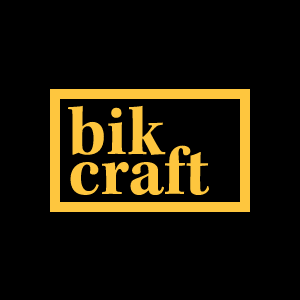

# 🚵‍ BIKCRAFT - Bicicletas Personalizadas 🚵‍♀️

Meu primeiro projeto de Design Web. Projeto realizado no curso "Web Design Completo" distribuído pela plataforma "Origamid".

# 📖 Sobre

A empresa Bikcraft (fictícia) é especializada na criação e montagem de bicicletas personalizadas e sob medida. Atualmente ela oferece três tipos de bicicletas: de passeio, espotiva e retrô.

O projeto foi realizado durante o curso "Web Design Completo" que é um curso criado e distribuido pela plataforma <a href="https://www.origamid.com"> Origamid </a>. O curso têm seu foco na base de <b>UI/UX Design e ##codificação</b>
